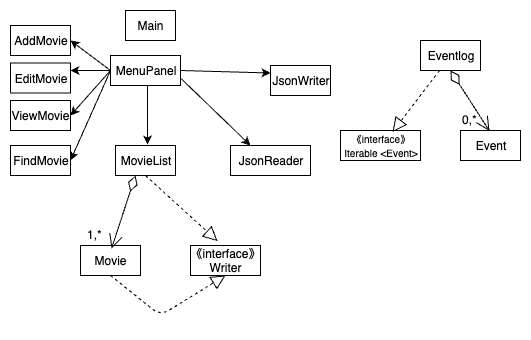

# Movie Library

## Tracking, rating and commenting on movies.

A *bulleted* list:
- Function: this app is designed for users to track movies they **have watched**.
For each movie in the list ,it has the function of rating with stars(1-10) as well as adding comments.
- Users: Anyone who would like to track the movies they interested in can use it.
- Reason:As a person who's interested in movies and literature, I have found the idea of having our own library of 
movies very important. It can keep tracking our *thoughts and comments*.

------

- As a user, when I add a movie, it is saved to the file.
- As a user, when I start the application, I want to be given the option to load my movie list from file.
  
 --------
- USER INTERFACE:
- As a user, I should be able to click a button to add a new movie, and this button
will lead to another button which gives me input: name, rating and review. 
- The second button 'edit movie' leads to a search panel, where I can type in the name.
- The third button 'print movie-list' lead to a new window with all movies listed.
- The forth button 'find movies' leads to search panel.

-----

**Phase 4: Task 2**
- Click *Add Movie* and input a movie :"A new movie added to the list"
- Click *Find Movie* and search for a name: "A movie is found."
- Click *Edit Movie* and search first then edit rating and review: "A movie has been edited"
- Click *View Movie* and refresh:"Movie list is printed"

----
**Phase 4: Task 3**

